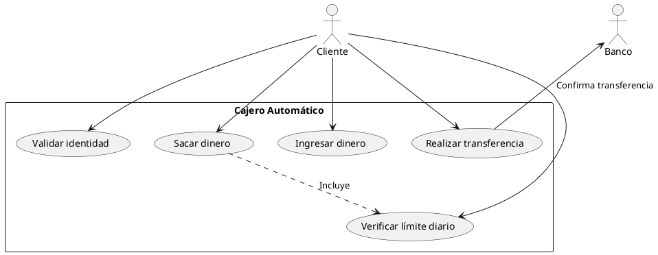

# CCC-BANCO-UML-1DAM

**Diagrama de Casos de Uso (PlantUML)**

---

### Descripción del Caso de Uso: Sacar Dinero

**Nombre:** Sacar Dinero  
**Actor:** Cliente  
**Precondiciones:** El cliente debe estar autenticado en el sistema  
**Flujo Principal:**
1. El cliente selecciona la opción de "Sacar dinero" en el cajero.
2. El sistema solicita la cantidad de dinero a retirar.
3. El cliente introduce la cantidad deseada.
4. El sistema verifica si hay saldo suficiente en la cuenta:
   - Si hay saldo suficiente, se pasa al paso 5.
   - Si no hay saldo suficiente, se muestra un mensaje de error y se solicita otra cantidad.
5. El sistema verifica si la cantidad solicitada supera el límite diario:
   - Si no supera el límite, se pasa al paso 6.
   - Si supera el límite, se muestra un mensaje de error y se solicita otra cantidad.
6. El cajero entrega el dinero al cliente y descuenta el saldo en la cuenta.
7. Se imprime un recibo y finaliza la transacción.

**Postcondiciones:** Se actualiza el saldo de la cuenta y el historial de transacciones.

---

### ¿Para qué sirve realizar un diagrama de casos de uso?

El diagrama de casos de uso sirve para representar de forma clara y estructurada las interacciones entre los actores y el sistema. Aporta los siguientes beneficios:
- **Claridad y organización:** Facilita la comprensión del sistema desde una perspectiva funcional.
- **Comunicación entre equipos:** Ayuda a que analistas, diseñadores y desarrolladores tengan una visión común del sistema.
- **Detección de requisitos faltantes o inconsistencias:** Permite identificar posibles errores o mejoras antes del desarrollo.
- **Base para el diseño y pruebas:** Sirve como referencia para la implementación y validación del sistema.

